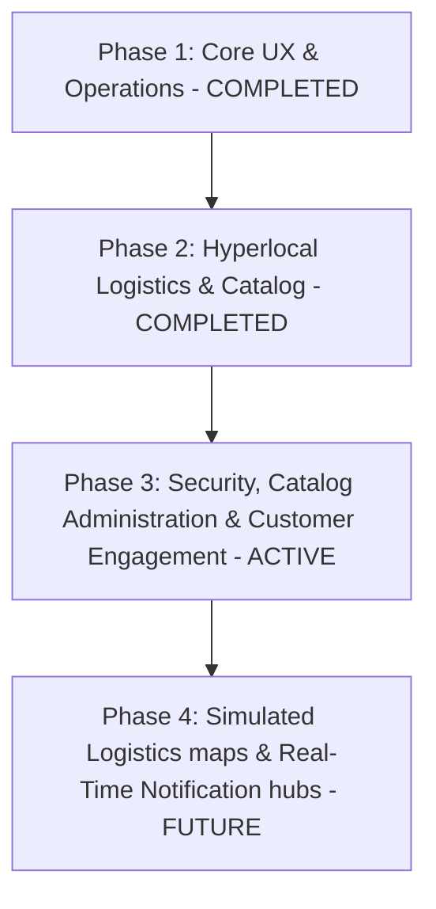
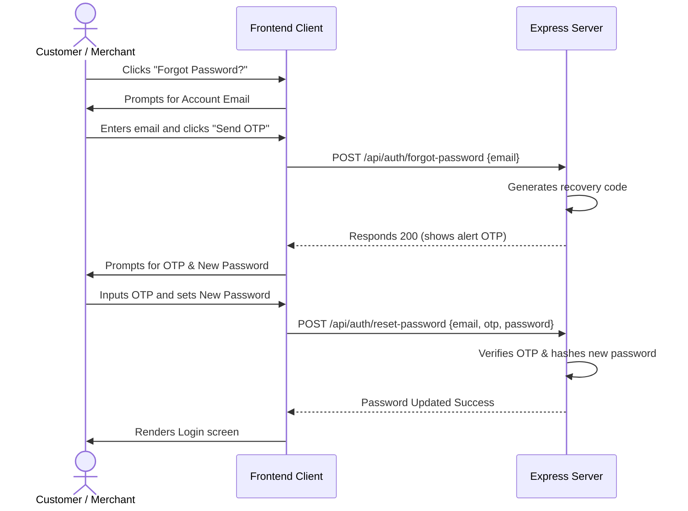

# Production Blueprint: Swiggy/Zomato-Grade Hyperlocal Marketplace Expansion

This blueprint defines the architecture, data schemas, and user flows to scale **LuxeGrocer** from a prototype into a production-grade hyperlocal marketplace.

---

## 🗺️ Implementation Phases



---

## Phase 1 & 2: Core Platform & Logistics (Completed & Deployed)
1. **Isolated Frontends & Ports**: Separated frontends served on port 8001 (customer-app) and 8002 (merchant-app) talking to Express backend on port 5000.
2. **Customer Account Center (Drawer UI)**: Slide dashboard with profile, saved address editor, voucher wallet, and reorder utilities.
3. **Hyperlocal Logistics & radius rules**: Haversine distance limit validation blocking checkout, dynamic tiered delivery fees (₹20 base + ₹10/km, free above ₹300).
4. **Interactive comparative search**: Search items globally across neighborhood stores, sorting by nearest distance.
5. **Product Variants support**: Database support and dropdown selectors for variants (e.g. Milk 500ml vs 1L) with variant-level stock deduction.

---

## Phase 3: Security, Catalog Administration & Customer Engagement (Active Plan)

### 1. Account Settings & Password Recovery Flow

#### Data Schema updates:
- We will store a `recoveryCode` and `recoveryExpiry` temporarily in memory or in the `users` table for password resets.



### 2. Merchant Catalog Variant Builder & Stock Toggles
- **Variants List Builder UI**: In the Add/Edit Product listing modal inside `merchant-app/index.html`, add a dynamic section allowing merchants to add/remove custom variant lines:
  - Input field for Variant Name (e.g. `100g`, `500ml`).
  - Input field for price (e.g. `45.00`).
  - Input field for stock count (e.g. `25`).
- **One-click Quick Stock Toggles**: A button in the inventory listing to toggle stock between `0` (Out of Stock) and `20` (In Stock) instantly via API without opening modal forms.

### 3. Hyperlocal UI Features: Favorites Bookmarking & Sort Filters
- **Storefront Heart Bookmarking**: Store favorite merchant IDs in browser `localStorage`. Bookmarked stores render first in a carousel list labeled `❤️ Favorite Neighborhood Stores`.
- **Landing Sorting**: Sort landing stores by:
  - **Fastest Sourcing**: Delivery times (based on distance).
  - **Highest Rating**: Store ratings.
  - **Lowest Delivery Fee**: Base delivery fees.

### 4. Post-Delivery Feedback, Reviews & Reviews Wall
- **Customer Ratings Modal**: Automatically triggers on the customer app when an order status shifts to `Delivered`.
  - Star score (1 to 5 stars selection).
  - Comment textarea box.
- **Reviews Table schema**:
  ```json
  "reviews": [
    {
      "id": "rev-12345",
      "storeId": "store-1",
      "orderId": "order-129882",
      "customerName": "Rahul Sharma",
      "rating": 5,
      "text": "Extremely fresh milk and butter!",
      "timestamp": "2026-06-06T13:20:00.000Z"
    }
  ]
  ```
- **Merchant reviews wall view**: Renders a dedicated sidebar panel showing customer comments and overall store rating graphs.
