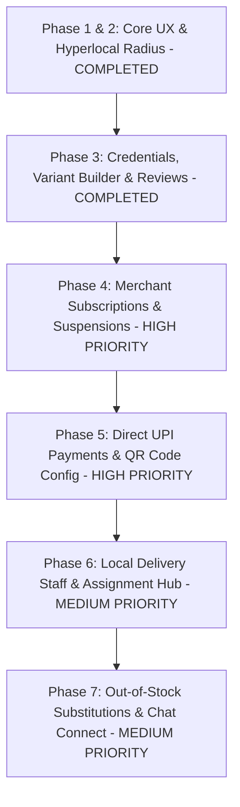

# Production Blueprint: Hyperlocal Self-Delivery & Subscription Marketplace

This blueprint defines the architecture, data schemas, monetization rules, and operational flows for **LuxeGrocer** scaled specifically to a **Merchant-Self-Delivery & Platform-Subscription** business model.

---

## 📐 Core Business Architecture

Unlike platforms that process payments and dispatch third-party gig riders, LuxeGrocer operates as a direct neighborhood digital-shelf connector:

1. **Merchant-Fulfilled Delivery (Self-Delivery)**: Stores utilize their own delivery boys/staff. Deliveries are dispatched directly by the store and verified at the customer's doorstep using a secure 4-digit OTP.
2. **Direct Peer-to-Peer Payments**: Payments flow directly from the customer's wallet to the merchant (via Cash on Delivery or direct merchant UPI). The platform does **not** process, hold, or split customer payments.
3. **Monetization via Subscription**: The platform charges merchants a recurring subscription fee (e.g., monthly/yearly shelf-space fee) to keep their storefront active. Stores with expired subscriptions are automatically suspended.

---

## 🗺️ Feature Priority Roadmap

We prioritize high-value operational and monetization features over low-impact social/review tools:



---

## 🚀 Proposed Features & Technical Specifications

### Phase 4: Merchant Subscriptions & Suspensions (Monetization Engine)
To ensure the platform generates revenue, we will implement a robust subscription billing management center for store owners.

#### Technical Specifications:
* **Database Schema Expansion (`users` / `stores` table)**:
  ```json
  "subscription": {
    "plan": "Premium Monthly", 
    "status": "Active", // "Active", "Expired", "Suspended"
    "expiresAt": "2026-07-06T00:00:00.000Z",
    "paymentDetails": { "cardLast4": "4242", "gateway": "MockStripe" }
  }
  ```
* **Merchant Billing Portal Panel**: A new tab pane inside the merchant console to view active subscription stats, renew plans, or upgrade from Free Trial via a simulated premium card checkout form.
* **Enforced Suspension Sweep**: A daily background cron job (or request hook) checks store subscriptions. If `now > expiresAt`, status transitions to `Suspended`.
* **Storefront Visibility Block**: Suspended stores are greyed out on the customer app with a "SUSPENDED" banner overlay, and checkout is blocked with an alert if a cart contains products from a suspended store.

---

### Phase 5: Direct UPI Payments & QR Code Configuration
Since customer payments go directly to the store owners, we must enable merchants to configure their UPI credentials to receive digital payments during checkout.

#### Technical Specifications:
* **Merchant UPI Settings UI**: Fields added to the Store settings page in the merchant console:
  * Merchant UPI VPA Address (e.g., `greenshop@okaxis`).
  * Payee Name (e.g., `Green Valley Boutique`).
* **Dynamic UPI QR Code Generator**: During checkout on the customer app, if "UPI Payment" is selected, the app dynamically constructs a standard UPI payment URL:
  `upi://pay?pa=greenshop@okaxis&pn=Green%20Valley%20Boutique&am=260.00&cu=INR`
  It renders this URL as a scannable QR Code on the checkout drawer.
* **Payment Reference Check**: Customer inputs their UPI Transaction Ref No. (UTR) / Transaction ID to submit the order. The merchant orders queue displays this Transaction ID so the store owner can verify the credit in their bank app before accepting the order.

---

### Phase 6: Local Delivery Staff Management & Assignment Hub
Since stores deliver using their own employees, they need an internal registry to organize dispatches.

#### Technical Specifications:
* **Delivery Staff Database Schema**:
  ```json
  "stores": [{
    "id": "store-1",
    "deliveryStaff": [
      { "id": "staff-1", "name": "Ramesh Kumar", "phone": "+91 99887 76655", "status": "Available" },
      { "id": "staff-2", "name": "Suresh Dev", "phone": "+91 98765 43210", "status": "Busy" }
    ]
  }]
  ```
* **Delivery Registry UI**: A sub-panel in the merchant settings to add, edit, or delete delivery staff members.
* **Dispatch Assignment Modal**: When a merchant clicks "Dispatch Rider" on a `Preparing` order, a modal pops up prompting them to assign a registered delivery staff member.
* **Customer-Facing Rider Card**: The customer order tracker dynamically displays:
  `🛵 Assigned Store Delivery Partner: Ramesh Kumar (Call: +91 99887 76655)`
  It enables the customer to call their neighborhood delivery boy directly.

---

### Phase 7: Out-of-Stock Item Substitutions & Chat Connect
In self-delivery grocer networks, items frequently sell out. Instead of cancelling the order, merchants coordinate substitutions directly.

#### Technical Specifications:
* **Substitution Proposals Schema**:
  ```json
  "orders": [{
    "id": "order-12345",
    "substitutionProposal": {
      "originalItemId": "p1-2",
      "suggestedProduct": { "id": "p1-4", "name": "Fresh Paneer (Cottage Cheese)", "price": 110.00 },
      "status": "Pending" // "Pending", "Accepted", "Declined"
    }
  }]
  ```
* **Merchant Substitution UI**: Next to each item in the merchant's active orders queue, a "Suggest Alternative" button opens their catalog to select a replacement item.
* **Real-time Customer Prompt**: The customer tracking view receives a real-time EventSource notification, popping up a modal: 
  `Store suggests replacing Organic Greek Yogurt (₹120) with Fresh Paneer (₹110). Adjust order?`
  * **Accept**: Automatically swaps the item in the database, recalculates totals, and updates both dashboards.
  * **Decline**: Removes the item, deducts its price from the order total, and refunds the item value.
* **Order Chat connect**: A basic overlay chat box on both views utilizing direct SSE sync logs, allowing merchants and customers to message each other directly regarding gate codes, delays, or custom requests.
